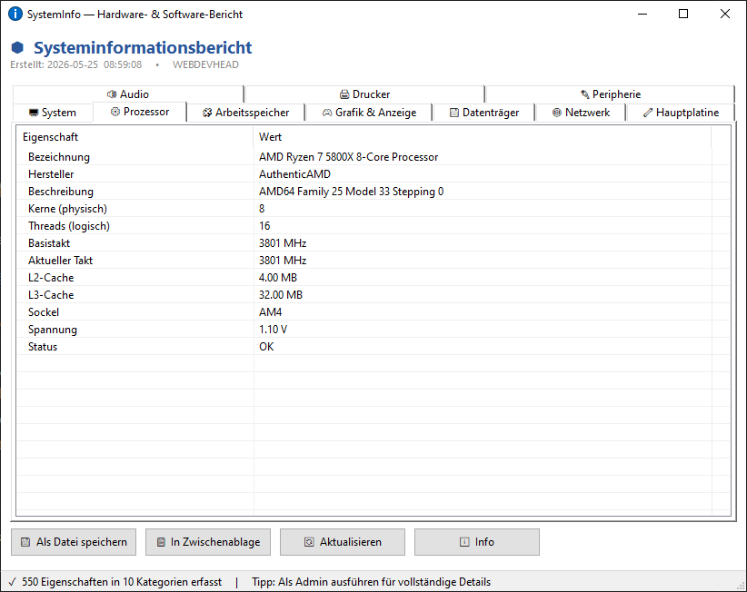

# SystemInfo
A comprehensive hardware & software report tool with export functionality.

  
## Features
- Simple, intuitive user-interface.
- Portable. No installation required, but provided for conveniance reasons.
- Small footprint. The UI itself just uses around 4MB RAM.
- Default language is German with automatic fallback to English on non-German systems.

## Usage
Just run SystemInfo.exe to get a detailed summary of your system.

To see information about your TPM chipset, run the tool in an elevated context (e.g., as admin).

## Known issues
Collecting system information takes some time. The tool fetches the information asynchronously to not block the UI. If run as admin, it's a little slower. 

If you get a virus warning it is a false positive. Some anti-virus programs are extremely paranoid and see things which are simply not there. I uploaded the binary to VirusTotal, provide a link in the release tag, and none of the anti-virus programs had an issue with it. However, that may change anytime.
